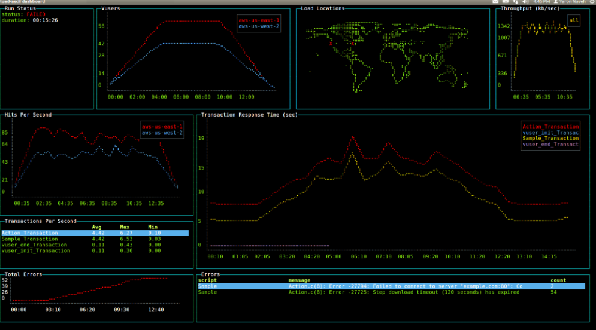

# Create a developer dashboard in the terminal using React

## 🔍 Project Overview
The fisrt part of this project focus on various ways to layout the dashboard, show how to change fonts, style with colors, and position text within each widget. 
The second part of this project focus on creating some widgets to display developer content such as an interactive time log, a pomodoro timer, displaying recent commits, currently running docker containers, and more.

## 🖥 Demo

## Running the demo

1. 1git clone https://github.com/yaronn/blessed-contrib.git
1. cd blessed-contrib
1. npm install
1. node ./examples/dashboard.js

